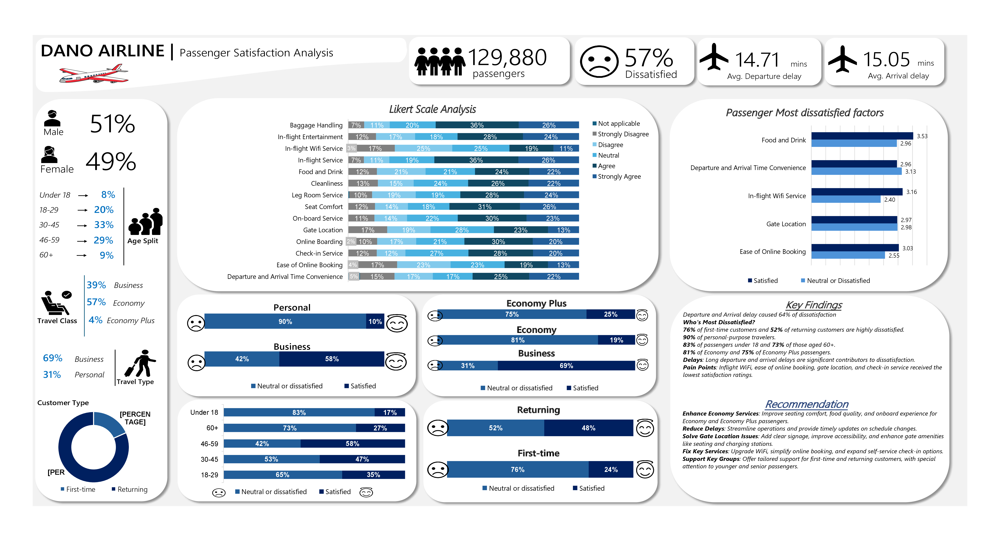

# Airline Dissatisfaction Study

## Introduction
This project analyzes passenger satisfaction data from Dano Airline to uncover key drivers of dissatisfaction and provide actionable recommendations. By leveraging data transformation, analysis, and visualization techniques, the findings aim to assist Dano Airline in enhancing customer experiences.

## Problem Statement
Dano Airline faces a high dissatisfaction rate, with 57% of passengers reporting dissatisfaction. Critical areas such as delays, in-flight services, and convenience are impacting passenger satisfaction, leading to potential revenue loss and negative brand perception.

## Skills Demonstrated  
Here’s what was done to solve the problem:  
- **Data Cleaning and Transformation:** Fixed messy data and organized it for easy analysis.  
- **Power Query and Pivot Tables:** Used tools like Power Query to automate data preparation and **pivot tables** for quick summaries and insights.  
- **Feature Engineering:** Created new categories, like age ranges, for deeper analysis.  
- **Data Visualization:** Designed a dashboard using Excel to communicate insights clearly.  

## Data Sourcing  
The dataset from Dano Airline is a dummy dataset but with real-life data, here is the link (https://docs.google.com/spreadsheets/d/15Kp-2yfQFNRGJPNOkpMwG-OMX8xVZOJ5VL7f35v7sRQ/edit#gid=1647986900) and included information like passenger age, travel class (economy, business), travel purposes, and satisfaction ratings for various services.  

## Data Transformation (Making the Data Ready for Use)  
Here’s how the data was cleaned and organized:  
1. **Studied the Data:** Learned what each column represented and identified problems.  
2. **Fixed Missing Values:**  
   - Marked empty rows as `NULL`.  
   - In the `Arrival Delay` column, replaced empty values with the **median** to maintain accuracy.  
3. **Created Age Ranges:** Grouped passengers into meaningful age brackets:  
   - Under 18, 18–29, 30–45, 46–59, and 60+.  
4. **Automated with Power Query:** Cleaned and organized the data efficiently.  
5. **Used Pivot Tables:** Summarized the data to analyze satisfaction levels across age groups, travel classes, and other categories.

## Modeling (Creating Useful Categories)  
To make the data more useful:  
- **Grouped Data:** Created satisfaction levels using a **Likert scale** (e.g., “Strongly Disagree” to “Strongly Agree”).  
- **Analyzed Travel Preferences:** Focused on travel types (business vs. personal) and travel classes (economy, economy plus, and business).  

## Analysis and Visualizations (What the Data Showed)  
The dashboard highlighted several key findings:  

### 1. **Who is Traveling?**  
- **Gender Split:** 51% Male, 49% Female.  
- **Age Groups:** Most passengers are aged **30–45 (33%)** and **46–59 (29%)**.  

### 2. **Why Are People Dissatisfied?**  
- **Delays:**  
   - Average departure delay: **14.71 minutes**.  
   - Average arrival delay: **15.05 minutes**.  
   - Delays caused **64% of dissatisfaction**.  

- **Top Dissatisfaction Factors:**  
   1. In-flight Wi-Fi.  
   2. Ease of online booking.  
   3. Gate location.  
   4. Food and drink.  
   5. Departure and arrival time convenience.  

### 3. **Who is Dissatisfied?**  
- **First-Time Passengers:** 76% are dissatisfied.  
- **Personal Travelers:** 90% are dissatisfied.  
- **Age Groups:** Younger travelers under 18 (83%) and seniors 60+ (73%) are the most dissatisfied.  
- **Travel Classes:** Economy passengers are the least satisfied (**81% dissatisfied**).  

### 4. **Likert Scale Analysis:**  
A **Likert scale** was used to analyze satisfaction ratings for services like baggage handling, seat comfort, and cleanliness. Low scores were common for in-flight Wi-Fi, ease of online booking, and gate locations.  

### 5. **Pivot Table Insights:**  
Pivot tables were used to quickly compare dissatisfaction rates across key categories, such as:  
- Age groups and their satisfaction levels.  
- Travel class (economy, business, etc.) and their associated satisfaction levels.  
- First-time vs. returning passengers and their dissatisfaction percentages.  

## Conclusion and Recommendations  
### What We Learned:  
- **Delays are a major issue:** Passengers are unhappy with long waits before takeoff and after landing.  
- **Services need improvement:** Economy passengers are the least satisfied, especially with food, Wi-Fi, and gate locations.  
- **Certain groups need more attention:** First-time travelers and senior citizens reported higher dissatisfaction.  

### What Dano Airline Should Do:  
1. **Improve Economy Services:**  
   - Make seats more comfortable.  
   - Offer better food options.  
   - Provide better onboard service.  

2. **Reduce Delays:**  
   - Improve operations to keep flights on time.  

3. **Fix Problem Areas:**  
   - Upgrade in-flight Wi-Fi for reliability and speed.  
   - Simplify online booking processes.  
   - Improve gate locations with better signage and accessibility.  

4. **Support Vulnerable Groups:**  
   - Provide special care for first-time and senior passengers to enhance their experience.  

  

